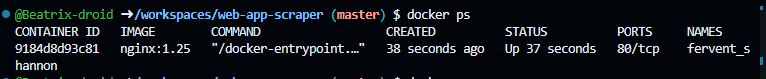
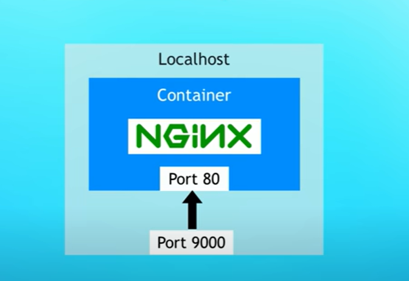

# docker notes cheatsheet

this is the first custom image I will try to to create a docker container for, so docker cheat sheet notes are contained here

## what is docker?

docker is a virtualization software.
in a generic OS, there is an application layer, and a kernel.  The kernel is the middle man between the application layer and the hardware. It manages memory, cpu and threads.

### docker vs virtual machine
Virtual machines will create both an abstract application layer AND a virtual kernel. So the images take up quite a lot of disk-space, and take a built to load.
Docker images on the other hand only abstract the application layer and use the host's kernel to operate. They boot up faster and take up a lot let space.
Initially they were created for linux (so a docker image could not run on windows because it was expecting to find a linux kernel and not a linux one but this has been changed)

Docker is great because different parts of an application can be packaged into an image, for every developer to install on their environment with a universal command, as opposed to doing this in the old fashioned way, where for an app each service needed to be installed differently depending on the developer's environment/

Docker thus makes the process of deploying applications and testing them a lot less error prone. Truly one procedure to follow that works on every env.

## docker images vs containers
a docker container is a running instance of a docker image.

Images are created and pushed to a registry, where developers can pull them down and work with them. The official docker registry is called "dockerhub". Unless you specify a different registry to look in, when you pull an image docker will automatically look there first. This is the main page of docker hub
<code>https://hub.docker.com/</code>

You don't need an acc on dockerhub to pull down their images

## some quick docker commands to:

-to pull an image from dockerhub: (unless the version is specified docker will pull the latest image)
 <code>docker pull {name of image}:{version}</code>

- to view downloaded local images:
<code> docker images</code>

 - to run a docker image:
 <code>docker run {name of image}:{version}</code>

 this will occupy a whole terminal session. To run a  docker image but have that terminal session free run: (the -d is used to run in detached mode)
<code>docker run -d {image name}:{version}</code>
the output returned is the id of the container running

- to view running local containers (processes)
<code>docker ps</code>

-to view logs of a specific running container:
<code>docker logs {CONTAINER ID}</code>

- to stop a running container
<code>docker stop {CONTAINER ID}</code>

- to list all containers on the host (running or not)
<code> docker ps -a</code>

- start one or more stopped containers:
<code>docker start {container}</code>

so following from the above example the command would be <code>docker logs a51e21e7d79d</code>

## Container Port vs host Port
- An application inside a container runs in an isolated Docker Network.This allows us to run the same up running on the same port multiple times.

- We need to <em>expose</em>. the container port to the host.  This is achieved through port binding: bind (map) the container's port to the host's port to make the service available to the outside world. Here for example, we bind port 80 of the ngnix container to port 9000 on our host, so that we can access that ngnix service on our host by going to localhost:9000  :

-to start a container (in detached mode) and map it to a specific port on our host simply run:

<code>docker run -d -p {HOST PORT}:{CONTAINER PORT} {IMAGE NAME}:{IMAGE VERSION}</code>

for example, to map/bind port 9000 of our host's to the container running nginx (that by default runs on port 80) we type:
<code> docker run -d -p 9000:80  nginx:1.25</code>

Only one service can run on a specific port on the host.